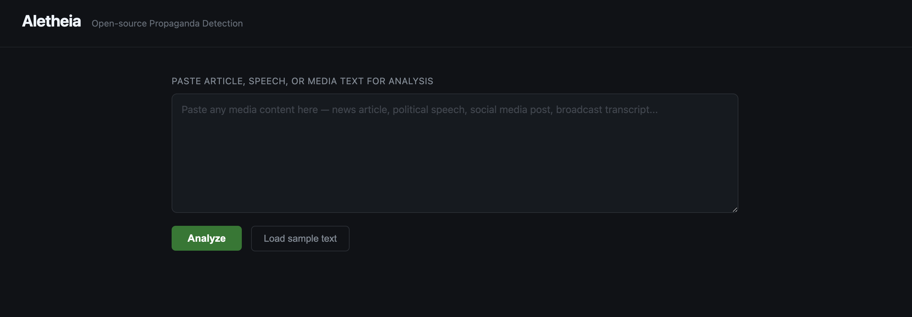

# Aletheia

**Open-source AI platform for detecting media propaganda — with built-in trust auditing**

Aletheia analyzes media content to identify the structural fingerprints of manipulation — rhetorical techniques, emotional persuasion tactics, and coordinated narrative patterns. It then goes one step further: it audits its own AI reasoning to tell you not just *what* it found, but *whether to trust the finding*.

> *Aletheia (ἀλήθεια): Ancient Greek for truth, disclosure, unconcealedness.*

---

## What It Does

Paste any text — a news article, political speech, social media thread, broadcast transcript — and Aletheia returns a structured analysis with a built-in trust verdict:

**Propaganda analysis**
- **Propaganda score** (0–10) with a plain-language verdict
- **Rhetorical techniques** — named manipulation tactics with quoted evidence (false dichotomy, manufactured urgency, dehumanizing language, appeal to fear, etc.)
- **Emotional manipulation** — which emotions are being targeted, at what intensity, and how
- **Narrative framing** — core story being constructed, us-vs-them dynamics, scapegoating, false urgency flags
- **Key passages** — specific quotes identified as manipulative, with explanations
- **Summary** — 2–3 sentence plain-language findings

**Reasoning trust audit**
- **CoT audit** — does Claude's explanation actually support its score, or are there logical leaps from evidence to conclusion?
- **Pattern verification** — do the claimed rhetorical techniques actually appear in the text?
- **Trust label** — a combined verdict on whether the analysis is reliable (see [Trust Labels](#trust-labels))

---

## Why It Matters

Democracy requires shared reality. Modern propaganda rarely works through outright lies — it works through emotional saturation and narrative anchoring that precede rational response. Generative AI now allows a single actor to produce thousands of thematically consistent articles, posts, and scripts in hours. Traditional fact-checking, which evaluates claims one at a time, cannot keep pace.

Aletheia uses AI to detect what human analysts cannot monitor at scale: the structural patterns that distinguish coordinated manipulation from legitimate political speech.

But AI-based detection introduces its own risk: a model may reach the *correct* propaganda score through *incorrect* reasoning — flagging a text because of political keywords or author cues rather than the actual manipulation structures. In high-stakes domains like propaganda detection, that's not good enough. Explainability isn't just nice to have; it's ethically and legally required.

That's why Aletheia audits its own reasoning. Every analysis comes with a trust label that tells you whether Claude's stated explanation actually supports its conclusion.

---

## Architecture

```
                    ┌─────────────────────────────────┐
                    │   Input: media text              │
                    └────────────────┬────────────────┘
                                     │
                                     ▼
                    ┌─────────────────────────────────┐
                    │   Claude propaganda analysis     │
                    │   (score + techniques + framing) │
                    └────────────────┬────────────────┘
                                     │
                         ┌───────────┴───────────┐
                         ▼                       ▼
              ┌─────────────────┐     ┌─────────────────────┐
              │  CoT audit      │     │  Pattern verifier   │
              │  (CoTShield)    │     │  (semantic + regex) │
              │                 │     │                     │
              │  Does Claude's  │     │  Do claimed         │
              │  reasoning      │     │  techniques appear  │
              │  support its    │     │  in the source      │
              │  conclusion?    │     │  text?              │
              └────────┬────────┘     └──────────┬──────────┘
                       └──────────┬──────────────┘
                                  ▼
              ┌──────────────────────────────────────────────┐
              │  Trust label                                 │
              │                                              │
              │  CoT clean + patterns verified               │
              │    → TRUSTWORTHY          (trust ~0.9)       │
              │  CoT suspect + patterns verified             │
              │    → HIDDEN_REASONING     (trust ~0.2)  ★   │
              │  CoT clean + patterns not found              │
              │    → HONEST_FAILURE       (trust ~0.35)      │
              │  CoT suspect + patterns not found            │
              │    → UNRELIABLE           (trust ~0.05)      │
              │  Pattern check not run                       │
              │    → UNVERIFIABLE         (trust varies)     │
              └──────────────────────────────────────────────┘
```

`HIDDEN_REASONING` is the critical failure mode: the propaganda score may be correct, but Claude's explanation doesn't hold up — suggesting the model is pattern-matching on surface features rather than structural manipulation. These results should not be used as evidence without human review.

---

## Demo

**Video demo** (1:43): [`demo/aletheia_demo.mp4`](demo/aletheia_demo.mp4)

The demo walks through all four trust labels — with Case 2 (HIDDEN_REASONING) as the centrepiece:
the model scores propaganda correctly while its reasoning explicitly denies finding any patterns.
See [`demo/DEMO_SCRIPT.md`](demo/DEMO_SCRIPT.md) for a full breakdown and instructions to regenerate.



Live demo: run locally (see setup below), paste text, get analysis in seconds.

---

## Setup

**Requirements:** Python 3.9+, an Anthropic API key

```bash
# Clone the repo
git clone https://github.com/lijiawei20161002/Aletheia
cd Aletheia

# Create virtual environment
python3 -m venv venv
source venv/bin/activate      # Windows: venv\Scripts\activate

# Install dependencies
pip install -r requirements.txt

# Set your API key
echo 'ANTHROPIC_API_KEY="your-key-here"' > .env

# Run
python main.py
```

Open `http://localhost:8000` in your browser.

CoTShield and AutoConjecture are bundled directly in this repo under `cotshield/` and `autoconjecture/` — no separate clones needed.

---

## API

### `POST /analyze`

```json
{
  "text": "string (max 10,000 characters)"
}
```

**Response:**

```json
{
  "propaganda_score": 8,
  "verdict": "Highly manipulative content using fear appeals and us-vs-them framing.",
  "rhetorical_techniques": [
    {
      "technique": "Appeal to Fear",
      "description": "Exaggerating threats to provoke fear rather than rational assessment.",
      "example": "every single day they remain in power, our nation inches closer to total collapse"
    }
  ],
  "emotional_manipulation": {
    "primary_emotion": "Fear",
    "secondary_emotions": ["Anger", "Disgust"],
    "intensity": "high",
    "analysis": "Content systematically targets fear and tribal outrage..."
  },
  "narrative_framing": {
    "core_narrative": "Patriotic citizens under existential threat from corrupt elites",
    "us_vs_them": true,
    "scapegoating": true,
    "false_urgency": true,
    "analysis": "..."
  },
  "key_passages": [
    {
      "passage": "this is our last chance to save the country",
      "concern": "False urgency designed to bypass deliberative reasoning"
    }
  ],
  "summary": "..."
}
```

### Python: audit an analysis response

```python
import httpx
from pipeline import PropagandaAuditPipeline

pipeline = PropagandaAuditPipeline()

text = "..."  # media article
response = httpx.post("http://localhost:8000/analyze", json={"text": text}).json()

verdict = pipeline.audit_analysis(text, response)
print(verdict.summary())
# Label      : TRUSTWORTHY
# Trust score: 0.87

if verdict.is_hidden_reasoning():
    print("WARNING: Propaganda score may be correct but explanation is unreliable.")
```

### Python: standalone reasoning audit

```python
from dual_layer import make_auditor

auditor = make_auditor(with_prover=True)

verdict = auditor.audit(
    reasoning="x + 0 = 0 because addition is symmetric",
    output="Therefore: forall x. x + 0 = x",
)
print(verdict.summary())
# Label      : HIDDEN_REASONING
# Trust score: 0.21
```

---

## Trust Labels

| Label | Meaning | Trust |
|---|---|---|
| `TRUSTWORTHY` | Reasoning supports conclusion; techniques verified in text | ~0.9 |
| `HIDDEN_REASONING` | Score may be right, but explanation doesn't hold up | ~0.2 |
| `HONEST_FAILURE` | Reasoning is sound but techniques not found in text | ~0.35 |
| `UNRELIABLE` | Both reasoning and verification failed | ~0.05 |
| `UNVERIFIABLE` | Pattern check not attempted | varies |

---

## Running the Examples

```bash
# Demo 1: Mathematical reasoning (no API key needed)
python examples/demo_math_reasoning.py

# Demo 2: Propaganda audit (no API key needed)
python examples/demo_propaganda.py

# Tests
python -m pytest tests/ -v
```

---

## Stack

- **Backend:** Python, FastAPI
- **AI:** Anthropic Claude (claude-sonnet-4-6)
- **CoT auditing:** CoTShield (bundled in `cotshield/`)
- **Formal verification:** AutoConjecture / Peano proof engine (bundled in `autoconjecture/`)
- **Frontend:** Vanilla HTML/CSS/JS (no build step)

---

## Roadmap

- [ ] Multilingual support (Arabic, Spanish, French, Mandarin)
- [ ] Narrative campaign detection — identify coordinated patterns across multiple documents
- [ ] Browser extension with inline trust labels
- [ ] Public campaign registry
- [ ] Independent methodology audit (false positive / adversarial robustness)
- [ ] CLI tool for batch analysis

---

## License

AGPL-3.0 — free to use, modify, and distribute. Contributions welcome.

---

## About

Built by [Jiawei Li](https://github.com/lijiawei20161002).
